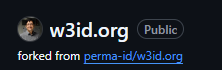
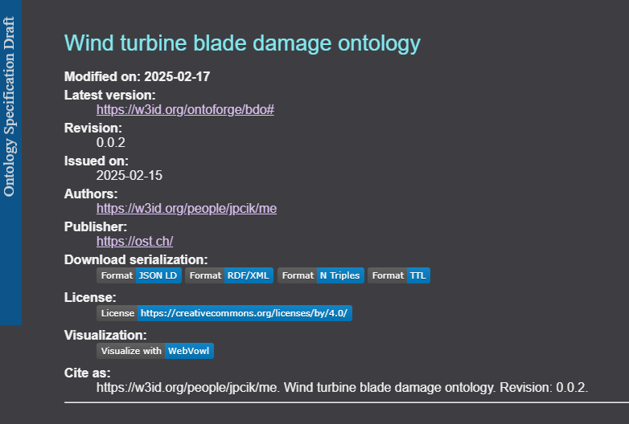

# Adding persistent URIs to your ontology

PErsistent URIs is one of the key enablers of ontology reusability, and accessibility, which are actually fundamental to comply with the [FAIR principles](https://www.go-fair.org/fair-principles/) of data reuse. 

We can first motivate the importance of using these URIs and then how to actually implement them in practice.

## Limitations of non-dereferenceable URIs

When creating a new ontology, it is often the case that concepts are defined using a base URI that does not necessarily can be dereferenced.

For example if you create an ontology about *Wind turbines*, perhaps in a first version the base URI for all concepts will be something like:

```
@prefix wind: <http://example.org/turbine-onto#>
```

**Note: ** We are using Trutle format for all examples.

Of course this URI cannot be dereferenced, it is simply a placeholder that is used during the development process.
Them if we have a concept `wind:Turbine`, its full URI will be `http://example.org/turbine-onto#Turbine`

This URI is not an existing web location, so if someone uses it, they cannot get additional information about it, they cannot get documentation nor links towards other relevant data about it.

## Limitations of non-persistent URIs

To solve this problem, it is important that the ontology is made available on the Web, so that others can use it and so that the concepts that it defines can be referenced and reused.

Moreover, even if we publish the ontology in a public URI, it is essential that these URIs persist in time, so to avoid that links are broken in the future.

For example, imagine that you publish your ontology in your company website at:

```
   https://my-company.com/myontologies/wind-turbines-ontology.owl
```

Moreover, knwoing that this is the base URIs, if there is a `Turbine` concept inside the ontology, it may be referenced as:

```
https://my-company.com/myontologies/wind-turbines-ontology.owl#Turbine
```

Now people can access the ontology online and potentially get more information and documentation about it. 

However, what happens if you decide to change the organization of the folders, for example liek this:

```
   https://my-company.com/knowledge/wind/wind-turbines-ontology.owl
```

In that case if anyone was referencing your ontology, the links will be broken. Even more, if your company is merged with another one, maybe even your domain may change:

```
   https://big-firm.com/knowledge/wind/wind-turbines-ontology.owl
```

And again links are broken.

## Permanent URI providers

To solve these problems, there exist services that allow creating persistent URIs. 
These URIs are designed to be maintained immutable over time, while they may redirect requests to real URLs if needed. Example of these providers are [purl.org](https://purl.archive.org/), and [w3id.org](w3id.org).

For example, we can define a persistent URI for the previous ontology on w3id.or, which could be:

```
   https://w3id.org/ontoforge/wind-turbines#
```

Then, this persistent URI can be redirected where the real ontology is, i.e. `https://my-company.com/knowledge/wind/wind-turbines-ontology.owl`. 
If in the future the real address changes, the redirection can be changed to `https://big-firm.com/knowledge/wind/wind-turbines-ontology.owl`, but the persistent URI remains.

## Using w3id

Now we can see the concrete example of w3id.org, and how it works.
It is a very simple mechanism that uses http redirection files. All of the configuration is done in a public Github repository, which can be accessed at: (https://github.com/perma-id/w3id.org)

As it is said in the w3id documentation, the steps to follow are:

 1. Fork the Repository for this system on GitHub.
 2. Add or update a new redirect entry and commit your changes.
    * If it does not yet exist, create a new directory with an intended permanent identifer name.
    * If they do not yet exist, add .htaccess and README.md files to the directory.
       * .htaccess contains redirection rules, for computer to read and perform.
       * README.md contains more identifier info and contact info, for human to read.
       * See w3id.org/examples for examples of .htaccess and README.md.
 3. Submit a Pull Request for your changes.


### Forking the repository

Forking the repository will create a copy that you are free to modify. You will see that the link to the original repo is maintained:



### Adding/updating a redirect

Once the fork is done the key is to create a `.htaccess` file. This is the file where redirections happen. 
The file should be in a folder or sub-folder, follwing the desired persistent URI. For example, if the URI is `https://w3id.org/ontoforge/wind-turbines#`, the the `.htaccess` file should be inside a `wind-turbine` flder, which in turn should be in an `ontoforge folder`.

The file is a simple text file with redirection rules. The easiest way is to copy another `.htaccess` file form another ontology and just modify the real URLs. You will typically find rules like this:

```
# Rewrite rule to serve HTML content from the vocabulary URI if requested
RewriteCond %{HTTP_ACCEPT} !application/rdf\+xml.*(text/html|application/xhtml\+xml)
RewriteCond %{HTTP_ACCEPT} text/html [OR]
RewriteCond %{HTTP_ACCEPT} application/xhtml\+xml [OR]
RewriteCond %{HTTP_USER_AGENT} ^Mozilla/.*
RewriteRule ^$ https://mycompany.com/myontologies/wind/index-en.html [R=303,L]

```

This line redirects requests to the persistent URI to html (this is what happens if you put the URI in your Web browser). The line you need to modify is the last one, and make sure it points to a web page that contains the documentation of your ontology.

An example of documentation is a page that looks like this, including explanations about your ontology and its classes:




You will need to do the same for all redirection rules.

You will also need to provide a README file explaining what your ontology is about and why you need to make it public.

### Submititng a pull request

Once you are happy with your changes you can commit and push your changes to your fork, and then you need to create a pull request. The pull request will be managed by the administrators of w3id.org, who will accept it or ask you for corrections if they detect any errors or missing details.

Once they merge your changes, you redirects will be ready and working online.